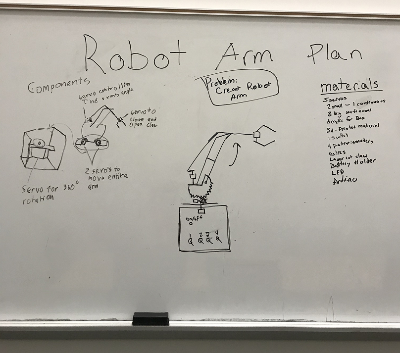

# Robot_Arm

### Planning
 
 Weeks - 8
 
 
 
 # Week 1 (Jan 22 - 24)
This week we will start the code. We will code the different servos to our intended purpose. We will set up 5 servos coding each one for the specific function we want.
 
# Week 2 (Jan 27-31)
Finish up the code and if everything goes well we could start the box near the end of the week. 

# Week 3 (Feb 3-7)
Design box and make sure all measurements are correct, create box in SolidWorks.

# Week 4 (Feb 10 -14)
Start on Claw portion, figure out measurements and implement into CAD.

# Week 5 (Feb 17 - 21)
Finish Claw, Motion Study analysis on it, start on Base and Gear System.

# Week 6 (Feb 24 - 28)
Finish Base and Box, Continue work on gear system and start measurements for Arm.

# Week 7 (Mar 2 - 6)
Implement Arm into CAD, hopefully finish it, and do Motion Study if Possible on Assembly.

# Week 8 (Mar 9 - 13)
Start 3D printing and Laser Cutting, Start Assembly.

# Week 9 (Mar 16 - 20)
Finish Assembly, Troubleshoot it.

# Week 10 (Mar 23 - 27)
Troubleshooting, and working on documentation.
